# Руководство для CSM

AIJ Project Console («Реестр AIJ-проектов») — рабочее место для ведения карточек AIJ-проектов. Задача CSM — создать карточку, регулярно обновлять статус, прогресс и следующий шаг, поддерживать флагманские данные и паспорт, чтобы проект корректно отражался в аналитике.

> Создавать и редактировать проекты могут пользователи с ролью **editor** или **admin**. Пользователь с ролью **viewer** может просматривать данные, но не увидит кнопки создания и редактирования.

## 1. Вход и навигация

1. Откройте адрес платформы, который выдал администратор.
2. Введите рабочий email и пароль.
3. Нажмите **«Войти»**.
4. В верхнем меню выберите **«Проекты»**.

Самостоятельной регистрации нет. Если пароль не работает, проверьте email и раскладку клавиатуры, затем обратитесь к администратору. Не отправляйте пароль в сообщениях.

В меню также доступны **«Дашборд»**, **«Аналитика»** и **«AI-аналитик»**. Общий AI-аналитик и GigaChat пока не подключены.

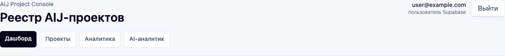

## 2. Найти свои проекты

На странице **«Проекты»**:

1. Выберите себя в фильтре **«CSM»**.
2. При необходимости добавьте **«Статус»** или **«Отраслевое управление»**.
3. Используйте поиск по ID, клиенту, названию или следующему шагу.

Архив скрыт по умолчанию. Чтобы увидеть архивные карточки, выберите **«Архив → Показать все»** или **«Только архив»**.

Фильтры сохраняются в адресе страницы. После открытия карточки используйте кнопку браузера **«Назад»**, чтобы вернуться к той же подборке и позиции. Ссылка **«Назад к проектам»** внутри карточки открывает реестр без фильтров.

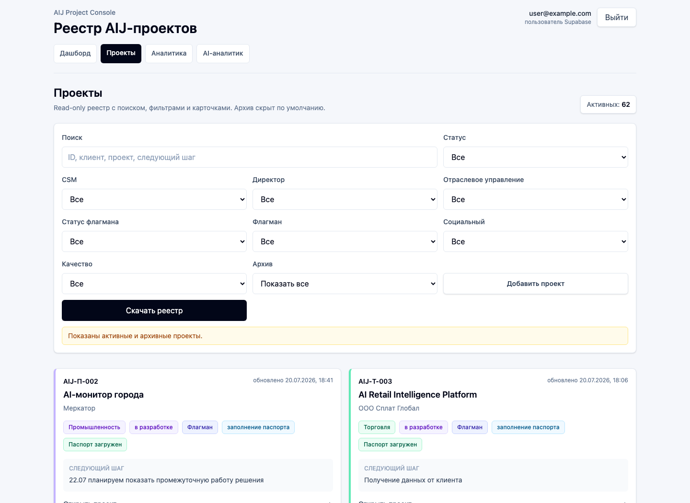

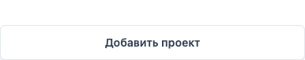

## 3. Создать новый проект

1. Откройте **«Проекты»**.
2. Нажмите **«Добавить проект»**.
3. Заполните основную информацию: клиент, название, статус, отраслевое управление, CSM и директор.
4. Добавьте суть проекта, прогресс, следующий шаг и комментарий.
5. Заполните блок финансирования. **«Социальный»** — это тег финансирования, а не тип отрасли.
6. Если проект флагманский, включите **«Флагман»** и заполните появившийся блок.
7. Нажмите **«Создать проект»**.

ID вводить не нужно: система присвоит его автоматически после сохранения. Затем откроется созданная карточка, где можно загрузить паспорт. Интерфейс позволяет сохранить незаполненные поля, но для корректной аналитики рекомендуется сразу указать как минимум клиента, название, суть, статус, отраслевое управление, CSM, директора и следующий шаг.

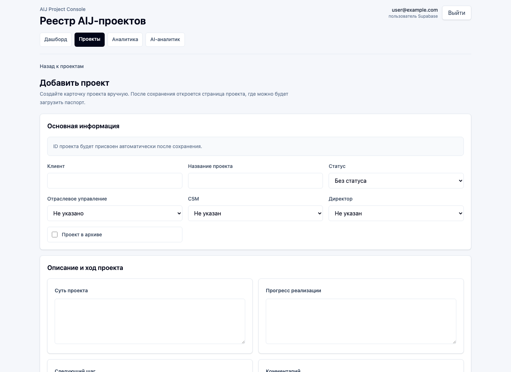

## 4. Редактировать проект

1. Найдите проект в реестре и откройте его карточку.
2. Нажмите **«Редактировать проект»**.
3. Обновите нужные разделы.
4. Нажмите **«Сохранить»**.

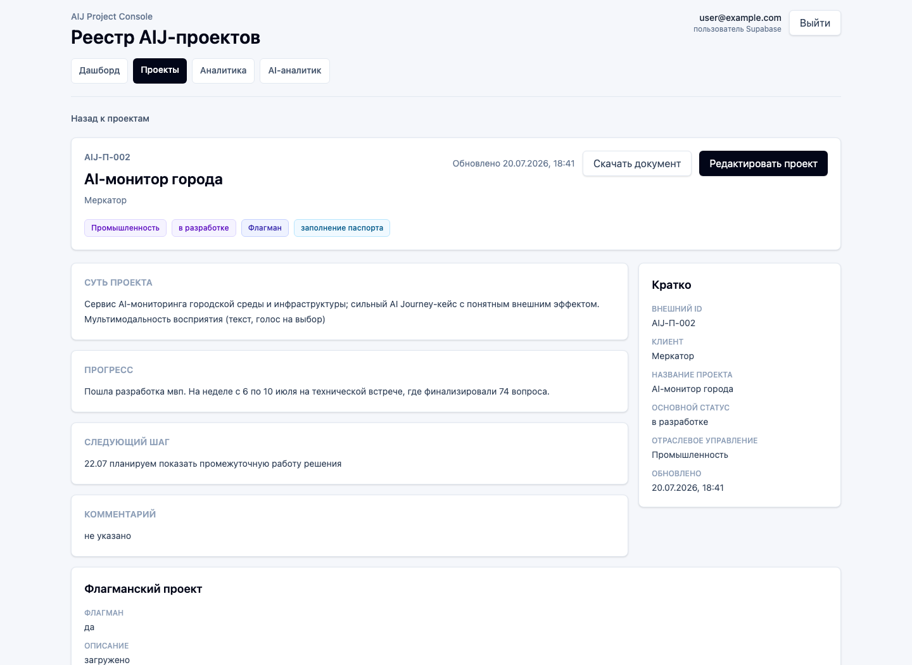

В режиме редактирования доступны:

- клиент и название проекта;
- основной статус;
- отраслевое управление;
- CSM и директор;
- суть, прогресс, следующий шаг и комментарий;
- статус и комментарий по финансированию;
- тег **«Социальный»**;
- признак **«Проект в архиве»**;
- флагманский блок.

Существующий внешний ID отображается в форме и обязателен для сохранения. Не меняйте его без согласованной причины. Для нового проекта ID создается автоматически.

После сохранения карточка, дашборд и аналитика обновляются. Внизу карточки находится **«История изменений»**: для каждого изменения показаны поле, старое и новое значение, дата и пользователь. Создание проекта также записывается в историю.

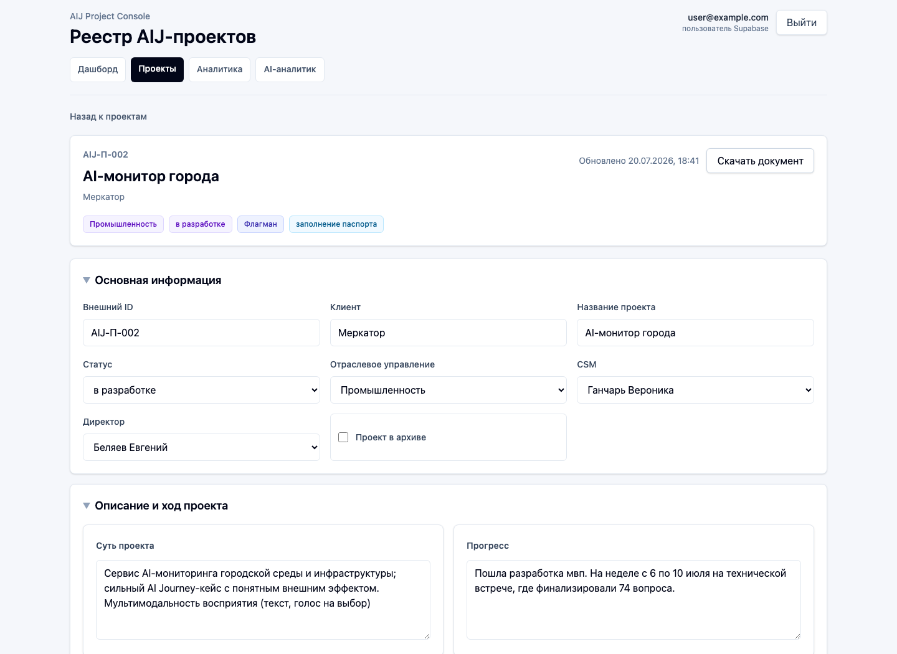

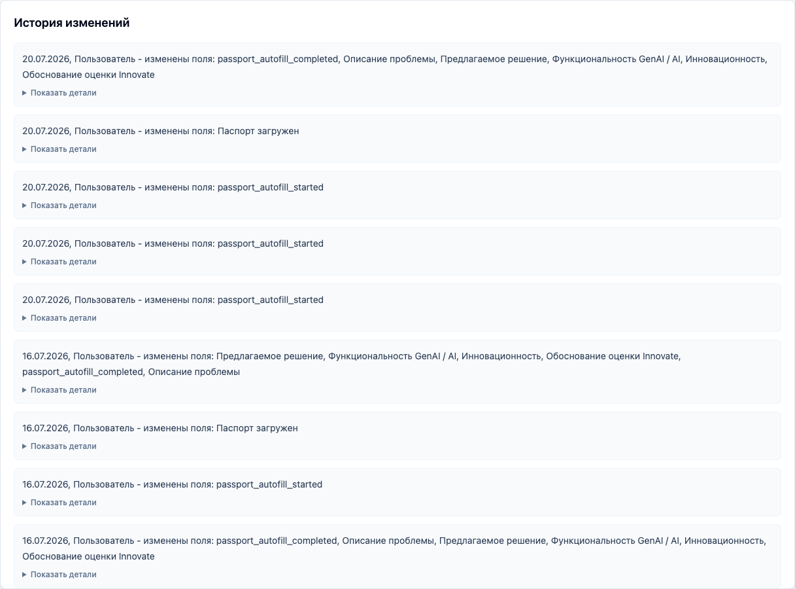

## 5. Флагманский проект

Включайте признак **«Флагман»** только для проекта, который согласован как флагманский по рабочим правилам команды. После включения заполните статус флагмана и паспортное описание.

Основные поля:

- **Что сейчас есть у клиента** — действующие системы, процессы, команды и решения.
- **Как выглядит текущий процесс** — участники, шаги, сроки и трудозатраты сейчас.
- **Что именно дорабатываем / создаем** — конкретный результат проекта.
- **Как и для чего клиент это использует** — пользовательский сценарий и задача.
- **Кто будет пользоваться результатом** — роли, команды и подразделения.
- **Технический стек** — технологии, компоненты и интеграции.
- **Какие данные доступны** — подтвержденные источники и наборы данных.
- **Какие данные пока под вопросом** — доступы, формат, полнота или качество, которые нужно уточнить.
- **Что точно не делаем** — границы текущего объема проекта.
- **Конкуренты** — похожие решения, альтернативы и ориентиры; поле можно заполнить позднее.

Серые подсказки внутри полей объясняют, что именно написать. Поля технически можно оставить пустыми и дополнить позже, но заполненность влияет на индикаторы готовности и аналитику.

Дополнительно доступны статус флагмана, уровень инновационности, признаки **«Загружен на ПРБР»** и **«Одобрен ЦА»**, а также поля **«Описание проблемы»**, **«Предлагаемое решение»** и **«Функциональность GenAI / AI»**. Эти результатные поля можно проверить и отредактировать вручную.

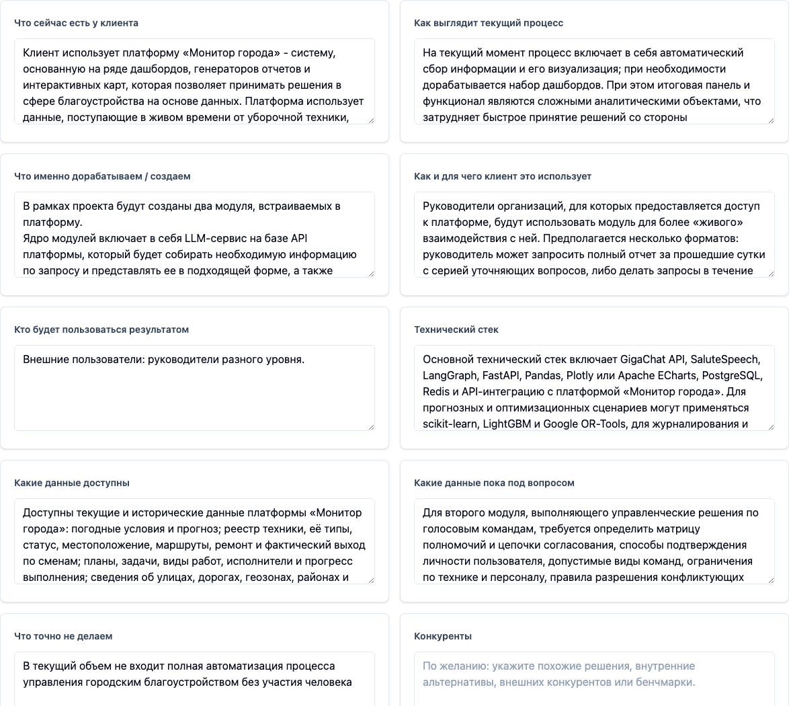

## 6. Паспорт и документ проекта

В карточке доступны два разных файла:

- **«Скачать документ»** — система формирует DOCX из текущих данных карточки.
- **«Паспорт проекта»** — загруженный файл паспорта с датой, версией и автором загрузки.

Чтобы загрузить или обновить паспорт:

1. Откройте карточку и нажмите **«Редактировать проект»**.
2. В блоке **«Паспорт проекта»** нажмите **«Загрузить обновленный паспорт»**.
3. Выберите PDF, DOCX, PPTX или XLSX размером не более 20 МБ.
4. Дождитесь сообщения об успешной загрузке.

Кнопка **«Скачать паспорт»** активна, когда в карточке есть текущий файл. Новая загрузка сохраняется как очередная версия, а наличие паспорта отмечается автоматически.

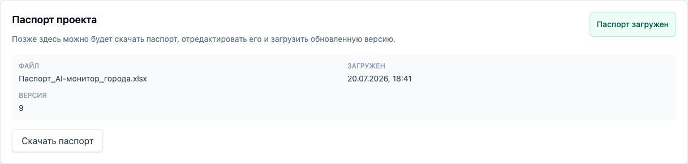

## 7. Автозаполнение паспорта флагманского проекта

### 7.1. Когда использовать

Автозаполнение предназначено для CSM с правом редактирования (**editor** или **admin**) и находится внутри режима редактирования флагманского проекта. Блок появляется после включения признака **«Флагман»**. Используйте его, когда исходное описание проекта уже подготовлено и нужно получить паспортные формулировки и оценку инновационности.

> **Важно:** цель — высокий уровень инновационности. Если после автозаполнения уровень средний или низкий, доработайте поля «Проблема», «Решение» и «Инновационность» вручную.

> **Ответственность CSM:** автозаполнение помогает подготовить паспорт, но CSM отвечает за смысловую проверку результата.

### 7.2. Что нужно заполнить перед автозаполнением

Заполните восемь исходных полей:

1. **Что сейчас есть у клиента**.
2. **Как выглядит текущий процесс**.
3. **Что именно дорабатываем / создаем**.
4. **Как и для чего клиент это использует**.
5. **Кто будет пользоваться результатом**.
6. **Технический стек**.
7. **Какие данные доступны**.
8. **Какие данные пока под вопросом**.

Пишите конкретно: называйте текущий процесс, пользователей, создаваемый результат, данные и ограничения. Чем полнее исходное описание, тем полезнее результат автозаполнения.

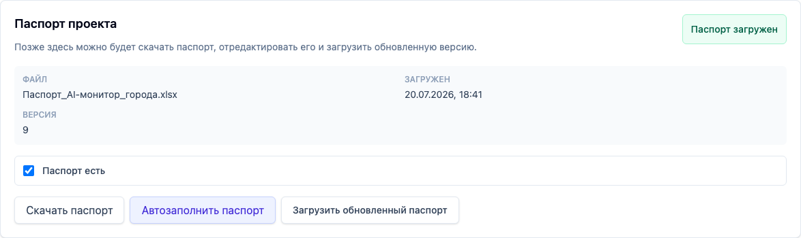

### 7.3. Как запустить автозаполнение

1. Сначала нажмите **«Сохранить»**, чтобы исходные поля попали в карточку проекта.
2. Снова откройте **«Редактировать проект»**.
3. В блоке **«Паспорт проекта»** нажмите **«Автозаполнить паспорт»**.
4. Не закрывайте страницу, пока отображается **«Обрабатываем...»** или статус обработки.

Система запускает обработку, отслеживает ее статус и после завершения сохраняет XLSX-паспорт как новую версию файла проекта.

### 7.4. Что система заполнит автоматически

После успешной обработки система переносит результат в редактируемые поля:

- **Описание проблемы** — проблема клиента, которую решает проект;
- **Предлагаемое решение** — способ решения проблемы;
- **Функциональность GenAI / AI** — ключевой сценарий работы решения;
- **Инновационность** — уровень **«высокий»**, **«средний»** или **«низкий»**;
- **Обоснование оценки Innovate** — причина оценки и, если доступны, рекомендации для выхода на высокий уровень.

Если высокая оценка не достигнута, интерфейс может показать **«Требуется помощь аналитика»**, а карточка — получить флагманский статус **«требуется помощь»**. При любом завершенном результате файл паспорта сохраняется в проекте.

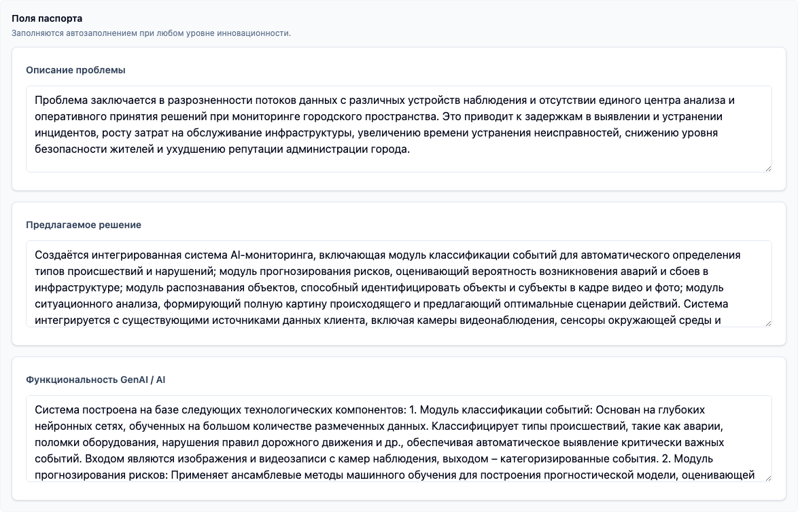

### 7.5. Как проверить результат

1. Прочитайте **«Описание проблемы»** и убедитесь, что сформулирована реальная задача клиента.
2. Проверьте **«Предлагаемое решение»**: оно должно соответствовать согласованному объему проекта.
3. Проверьте **«Функциональность GenAI / AI»** и исключите неподтвержденные возможности.
4. Посмотрите значение **«Инновационность»** и автоматическое обоснование.
5. Сверьте результат с восемью исходными полями и исправьте фактические ошибки.

Автоматически подготовленные формулировки не считаются согласованными без проверки CSM.

### 7.6. Как довести инновационность до высокого уровня

Если выбрано **«средний»** или **«низкий»**:

1. Прочитайте **«Обоснование оценки Innovate»** и рекомендации **«Что нужно для высокой оценки»**, если они показаны.
2. Вручную уточните **«Описание проблемы»**, **«Предлагаемое решение»** и **«Функциональность GenAI / AI»**.
3. Уточните исходные поля, если в них не хватает отличий от текущего процесса, роли AI, масштаба эффекта или данных.
4. Выберите **«высокий»** в поле **«Инновационность»** только после смысловой проверки и согласования формулировок.
5. Нажмите **«Сохранить»**.

Не повышайте оценку только ради индикатора: описание должно подтверждать высокий уровень.

### 7.7. Что означает «Описание загружено»

Индикатор **«Описание загружено»** означает, что в карточке подготовлен обязательный контур описания флагманского проекта. Он рассчитывается по заполненности описательных полей и обновляется после сохранения. Само нажатие **«Автозаполнить паспорт»** не заменяет заполнение и сохранение исходного описания.

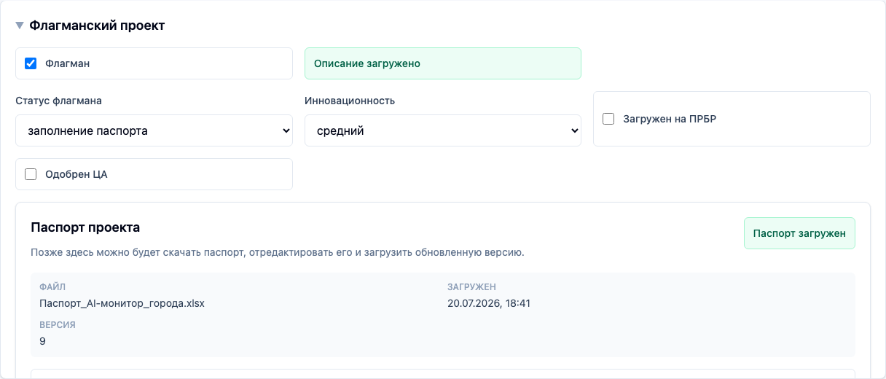

### 7.8. Пошаговый пример

1. Откройте проект.
2. Нажмите **«Редактировать проект»**.
3. Включите признак **«Флагман»**, если проект флагманский.
4. Заполните восемь полей описания проекта.
5. Сохраните проект и снова откройте редактирование.
6. Нажмите **«Автозаполнить паспорт»**.
7. Проверьте **«Описание проблемы»**, **«Предлагаемое решение»** и **«Инновационность»**.
8. Если инновационность не высокая, отредактируйте формулировки вручную.
9. Нажмите **«Сохранить»**.
10. Убедитесь, что отображается **«Описание загружено»** и сохранена актуальная версия паспорта.

### 7.9. Частые ошибки

- **Кнопка вернула ошибку.** Проверьте, что проект сохранен и доступен для редактирования. Если ошибка повторяется, сообщите администратору ID проекта: сервис автозаполнения может быть недоступен или не настроен.
- **Результат слишком общий.** Дополните восемь исходных полей конкретными процессами, пользователями, данными и границами решения, сохраните проект и повторите проверку.
- **Инновационность средняя или низкая.** Используйте обоснование оценки, вручную улучшите формулировки и сохраните карточку.
- **Не появился индикатор «Описание загружено».** Проверьте обязательные поля описания флагмана и сохраните проект.
- **Обработка завершилась со статусом «требуется помощь».** Проверьте сохраненный паспорт и обратитесь к аналитику для смысловой доработки.

Это не означает, что общий раздел **«AI-аналитик»** подключен: он остается отдельной функцией, а провайдер автозаполнения в пользовательском интерфейсе не называется.

## 8. Другие автоматические действия

Система также автоматически:

- присваивает ID новому проекту;
- записывает создание и изменения полей в историю;
- обновляет дашборд и аналитику после сохранения;
- рассчитывает качество карточки по восьми ключевым полям;
- отмечает наличие паспорта после успешной загрузки файла;
- сохраняет черновик формы локально в текущей вкладке браузера.

## 9. Защита черновика

При изменении формы черновик сохраняется локально примерно через секунду; появляется сообщение **«Черновик сохранен»**. Черновик относится к текущему пользователю, проекту и вкладке браузера.

Если вы вернулись к незавершенной форме, появится блок **«Найден несохраненный черновик»**:

- **«Восстановить»** возвращает локальные изменения;
- **«Удалить черновик»** удаляет их.

При попытке закрыть или покинуть страницу с несохраненными изменениями браузер предупреждает об этом. Черновик очищается после успешного сохранения, осознанной отмены или нажатия **«Удалить черновик»**. Он не заменяет сохранение в базе и не переносится в другую вкладку или на другое устройство.

## 10. Частые сценарии

### Создать новый проект

**Проекты → Добавить проект → заполнить карточку → Создать проект.** Проверьте выданный ID и заполните паспорт при необходимости.

### Обновить следующий шаг

Найдите проект → **«Редактировать проект»** → измените **«Следующий шаг»** → **«Сохранить»**.

### Перевести проект в другой статус

Откройте редактирование → выберите новый **«Статус»** → проверьте прогресс и следующий шаг → сохраните.

### Заполнить флагманский блок

Откройте редактирование → включите **«Флагман»** → заполните статус, паспортные поля и признаки → сохраните → проверьте индикаторы готовности.

### Загрузить паспорт

Откройте редактирование → **«Загрузить обновленный паспорт»** → выберите допустимый файл до 20 МБ → дождитесь подтверждения.

### Архивировать проект

Откройте редактирование → включите **«Проект в архиве»** → сохраните. Проект исчезнет из обычного списка и аналитики, но останется доступен в режиме архива.

### Найти свои проекты

Откройте **«Проекты»** → выберите себя в фильтре **«CSM»** → при необходимости добавьте статус или отраслевое управление.

### Проверить, что проект попал в аналитику

1. Убедитесь, что проект не архивный.
2. Проверьте статус, отраслевое управление, CSM и директора.
3. Откройте **«Аналитика»** и найдите проект через нужный срез или CSM-матрицу.
4. Если карточка неполная, проверьте блок качества и категории **«Без …»**.

## 11. FAQ

### Почему ID нельзя ввести руками?

Для нового проекта ID генерируется автоматически, чтобы избежать дубликатов. В существующей карточке внешний ID доступен редактору, но менять его без согласования не следует.

### Почему проект не виден в общем списке?

Проверьте активные фильтры и поиск. Затем проверьте режим архива. Нажмите **«Сбросить фильтры»**, если подборка пуста.

### Почему проект в архиве?

В карточке установлен признак **«Проект в архиве»**. Откройте режим **«Только архив»**, найдите проект и снимите признак в редактировании, если проект должен быть активным.

### Почему поле подсвечивается как незаполненное?

Аналитика качества проверяет восемь ключевых полей, а флагманская готовность — отдельные паспортные поля. Заполните недостающие данные и сохраните карточку.

### Что делать, если случайно ушел со страницы редактирования?

Вернитесь в ту же форму в той же вкладке. Если появился блок о черновике, нажмите **«Восстановить»**. Если черновика нет, проверьте историю: возможно, изменения уже были сохранены.

### Кто может менять роли и справочники?

Только администратор. Пользователь с ролью **editor** создает и редактирует проекты, а **viewer** только просматривает их.
